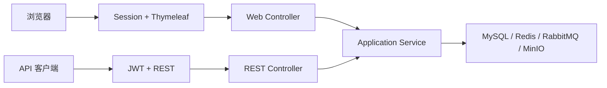

# 多源航迹分析与报告管理平台

Java 17 / Spring Boot 3.5 模块化单体后端，完成注册登录、用户数据隔离、CSV 流式解析、MinIO 原文件存储、MySQL 批量入库、同步与 RabbitMQ 异步分析、Redis Cache-Aside，以及不可变 HTML 分析报告。

项目公开基线为已验收的 REST API 数据处理链路。Thymeleaf 网页与 Redis Session 兼容扩展仍在迭代，不作为已完成的发布承诺；其当前范围、验证记录和剩余事项见 `PLANS.md`。仓库仅包含人工构造的非敏感 CSV 样例，运行凭据必须保存在本地 `.env`，不得提交。

## 技术栈与架构

Spring MVC、Security/JWT、Validation、MyBatis-Plus/MyBatis XML、Flyway、MySQL 8.4、MinIO、RabbitMQ、Redis、Springdoc、Testcontainers。控制器只处理 HTTP；应用服务编排用例和事务；规则与状态位于业务模块；基础设施适配器隔离数据库和中间件。

## 从零运行

要求 JDK 17、Docker Desktop/Engine 与 Compose v2。复制 `.env.example` 为被 Git 忽略的 `.env`，替换所有占位凭据；端口默认只绑定 `127.0.0.1`。

```powershell
Copy-Item .env.example .env
docker compose --env-file .env config --quiet
docker compose --env-file .env up -d
Get-Content .env | Where-Object { $_ -match '^[A-Z][A-Z0-9_]*=' } | ForEach-Object { $n,$v=$_ -split '=',2; Set-Item "Env:$n" $v }
.\mvnw.cmd spring-boot:run
```

本地应用：`http://127.0.0.1:8080`；Swagger UI：`/swagger-ui.html`；OpenAPI：`/v3/api-docs`；健康检查：`/actuator/health`。

容器化运行应用及四个依赖：

```powershell
docker compose --env-file .env -f compose.yaml -f compose.app.yaml up -d --build
docker compose -f compose.yaml -f compose.app.yaml ps
```

镜像使用 Java 17 多阶段构建，运行层仅包含 JRE 和应用 JAR，并以 UID 10001 非 root 用户运行。不要使用 `docker compose down -v`，除非明确要删除所有命名卷。

## 核心流程

注册/登录 → 创建数据集 → 上传三个来源 CSV → 流式解析与批量入库 → 同步或异步分析 → latest/comparison 查询 → 生成报告 → 查询历史 → 在线查看或下载 HTML。

`samples/` 是人工构造的非敏感小样例。可重复的完整演示会用固定种子自动生成三份 2000 点仿真航迹，然后真实执行上传、解析、同步/异步分析、Redis 缓存和 HTML 报告链路：

```powershell
$env:JAVA_HOME='D:\java\JDK17'
$env:Path="$env:JAVA_HOME\bin;$env:Path"
.\scripts\demo.ps1
```

脚本会按需启动四个 Compose 依赖和本地应用，完成后只停止本次启动的应用进程。它不会打印或保存密码、完整 JWT、Secret，也不会删除数据卷、bucket 或业务记录。生成的 CSV、摘要、日志和报告均写入被 Git 忽略的 `demo-output/`。完整说明见 `docs/demo-guide.md`。

## 验证

```powershell
$env:JAVA_HOME='D:\java\JDK17'
$env:Path="$env:JAVA_HOME\bin;$env:Path"
.\mvnw.cmd spotless:apply
.\mvnw.cmd spotless:check
.\mvnw.cmd clean verify
docker version
docker info
.\mvnw.cmd clean verify -Pit
.\mvnw.cmd dependency:tree -Dverbose
```

`-Pit` 使用 Testcontainers 验证 MySQL 8.4 等真实基础设施。性能烟测生成临时合成 CSV，不提交大文件；结果和限制记录在 `docs/performance.md`。

## 环境变量

必需项为 MySQL 用户/密码、JWT Secret、Redis 密码、RabbitMQ 用户/密码、MinIO 用户/密码。完整清单和安全占位值见 `.env.example`。Redis 密码限定为 16–128 位 ASCII 字母、数字、点、下划线或连字符。

## 文档

- `docs/api.md`：接口和状态码
- `docs/architecture.md`：上下文、模块与关键流程图
- `docs/database.md`：V1–V9、表、外键和索引
- `docs/testing.md`：测试策略与验收证据
- `docs/performance.md`：本机工程烟测方法、实测数据与限制
- `docs/interview.md`：简历描述、一分钟/三分钟介绍和追问

## 七个里程碑

0 工程骨架、1 持久化、2 认证与数据集、3 CSV/MinIO、4 同步分析闭环、5 RabbitMQ/Redis、6 报告与最终交付。状态和真实验收记录以 `PLANS.md` 为准。

## 已知限制

公开基线不包含 PDF/Word/Excel 导出、AI 报告、邮件/定时/审批、微服务、Kubernetes、Kafka 或 Prometheus/Grafana 平台。HTML 报告是生成时快照，不作算法显著性、吞吐量或生产部署结论。网页兼容扩展与可靠投递相关的后续工作不属于该基线，不能据此作已完成承诺。

## 浏览器兼容扩展（开发中）

项目保留 `/api/**` 的无状态 JWT REST 接口，同时增加 Thymeleaf 网页入口。API 客户端继续通过 Bearer Token 调用；浏览器通过表单登录和 Spring Session Redis 使用 `/app/**`，管理员页面位于 `/admin/**`。两者共享 `sys_user`、BCrypt 密码、角色、应用服务、MySQL、RabbitMQ 和 MinIO，不复制业务模型。



第一条 `SecurityFilterChain` 以最高优先级只匹配 `/api/**`，不读取 Session、关闭 CSRF，并返回 JSON 401/403。第二条链负责 `/login`、`/app/**` 和 `/admin/**`，启用 CSRF、Session Fixation 防护和表单退出。JWT Filter 的 Servlet 自动注册被显式禁用，保证它不会过滤网页请求。

公众注册默认通过 `APP_PUBLIC_REGISTRATION_ENABLED=false` 关闭。首个管理员仅在数据库没有可用 ADMIN 时由 `APP_ADMIN_USERNAME` 和 `APP_ADMIN_PASSWORD` 初始化；初始化可重复执行且已有可用管理员时不会新增账号。密码至少 12 位且只保存 BCrypt 哈希，不记录到日志。网页会话默认 30 分钟，Redis namespace 为 `track-analysis:web-session`，并使用按稳定用户名建立 principal 索引的 indexed repository；这使应用可以精确查找同一用户的多个 Session，而不扫描 Redis 全库。用户名当前不可编辑，因此不会产生索引名称迁移问题。本地 HTTP 使用 `WEB_SESSION_COOKIE_SECURE=false`，HTTPS 部署必须设为 `true`。

禁用、启用、管理员重置密码、用户自行修改密码或角色变更都会递增 `auth_version`，因此旧 JWT 永久失效；事务成功提交后会发布安全变更事件并删除目标用户的全部网页 Session，其他用户不受影响。清理放在 `AFTER_COMMIT` 是为了避免数据库事务回滚时错误踢出用户。若提交后的 Redis 清理失败，数据库安全变更保持成功，应用记录带堆栈的安全错误而不向用户虚报主操作失败；此时数据库状态与 `auth_version` 仍会阻止旧身份继续通过业务身份检查，但运维必须根据错误日志恢复 Redis 并重新执行失效操作。Session 删除本身是幂等的，并适用于共享同一 Redis 的多实例部署。

当前网页入口包括 `/login`、`/app/dashboard`、`/app/profile`、`/app/datasets`、按文件查询的 `/app/tasks?fileId=...`、`/app/tasks/{id}`、`/app/results/{fileId}`、`/admin/users`、`/admin/users/{id}` 与 `/admin/audit-logs`。用户可验证旧密码后自行改密；管理员可创建、启停、重置密码、编辑基本资料并重分配角色。最后一个可用管理员的禁用或降权通过锁定 `ADMIN` 角色行串行化，并结合乐观锁检测同一用户的并发修改。

真实 HTTP 烟测使用 `./scripts/smoke-web-auth.ps1`。脚本在现有 MySQL 中创建独立验收数据库，由 Flyway 和应用管理员引导逻辑初始化，通过网页表单创建研究员，在内存生成临时密码，验证双 Session、JWT、CSRF、权限、禁用/启用、重置密码、自助改密、角色变更、审计与 Redis principal 索引，最后恢复原 app 配置；不会输出密码、JWT、Cookie 或 Session ID，也不会删除数据库或 Volume。

V12 在不修改 V1-V11 的前提下增加任务租约字段、数据集删除状态和 `reliable_outbox`。消费者通过唯一 `lease_token` 原子领取任务，由共享的受管理调度器续租；恢复只匹配已过期租约，完成/失败必须仍持有令牌。数据集删除先在 MySQL 事务内写入 `DELETE_PENDING`、关键审计及幂等清理事件，再由清理器删除 MinIO 对象并条件完成为 `DELETED`；失败进入可观察、退避重试流程。RabbitMQ 任务发布也由 Outbox 恢复。完整业务烟测入口为 `./scripts/smoke-web-business.ps1`，覆盖真实上传、解析、任务、结果、删除状态机与身份失效；最终验收前必须在本轮最终镜像上实际执行成功。

测试证据必须分开报告：`clean verify` 是单元及 MockMvc 测试；`clean verify -Pit` 另外执行 MySQL 8.4 Testcontainers/Failsafe 持久化和 API 集成测试；indexed Redis 的真实行为由 Compose HTTP 烟测验证。网页兼容扩展尚未完成独立人工视觉验收和最终独立评审，不能标记为完成；详情见 `PLANS.md`。
