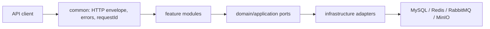

# 多源航迹数据分析与报告管理平台

`track-analysis-platform` 是一个面向 Java 后端工程实践的模块化单体项目。目标业务闭环是：安全地接收七列航迹 CSV，流式解析和批量入库，异步计算三维误差与连续异常区间，并管理分析结果和模板报告。

> 当前状态：唯一有效路线共七个里程碑（0—6）。里程碑 0—3 已完成，里程碑 4 尚未开始。当前已实现 CSV 上传、MinIO 私有原文件存储、SHA-256 去重、固定七列流式解析和 `track_point` 批量入库；误差/RMSE、异常区间、消息、缓存和报告业务尚未实现。

## 当前功能

- `GET /api/v1/ping`：统一 `Result<T>` 成功响应。
- `X-Request-Id`：接受安全的调用方 ID，缺失或不安全时生成 UUID，并写入响应头和 MDC。
- 全局异常映射：稳定业务错误码、合理 HTTP 状态、安全的未知错误响应。
- Actuator：health、info、metrics、Prometheus 端点基础配置。
- Compose 基础依赖定义：MySQL、Redis、RabbitMQ、MinIO；当前 MySQL 和 MinIO 已接入里程碑 3 业务链路。
- Flyway 管理的 `sys_user`、`dataset` schema，以及 MyBatis-Plus Mapper、分页、逻辑删除、乐观锁、UTC 自动填充和全表操作防护。
- 注册、登录、当前用户和全局退出接口；BCrypt 密码哈希、Spring Security 无状态 Bearer 认证，以及可配置的 JWT Access Token。
- 当前用户范围内的数据集创建、详情、分页/名称搜索、乐观锁更新和逻辑删除；所有权直接进入 Mapper SQL 条件。
- Springdoc OpenAPI JSON 和 Swagger UI，包含 Bearer Token 安全方案。

当前范围边界：只有单一 Access Token，没有 Refresh Token、Redis 登录态、RBAC 或多设备会话；已有航迹点批量写入的生产 MyBatis XML，但没有误差/RMSE、异常区间等航迹分析，也没有 RabbitMQ、Redis 业务缓存或报告功能；里程碑 4 尚未开始。

## 技术基线

- Java 17 bytecode/API target, Maven, Spring Boot 3.5.15
- Spring MVC, Validation, Actuator, Micrometer Prometheus registry
- Flyway 11.20.1, MyBatis-Plus 3.5.17, Spring Security, JJWT 0.13.0, Springdoc 2.8.17, MySQL Connector/J
- JUnit 5, MockMvc, AssertJ, Testcontainers, JaCoCo, Spotless
- MySQL 8.4, Redis 8.x, RabbitMQ 4.x, MinIO through Docker Compose

MinIO 已用于私有原始 CSV 存储；Redis 和 RabbitMQ 应用依赖仍按后续里程碑推迟。`TrackPointMapper.xml` 是首个生产 MyBatis XML，以 `foreach` 实现可配置批量写入。

## Architecture



The current code contains the cross-cutting HTTP foundation, stateless authentication, owner-scoped datasets, and the upload-to-streaming-ingestion path. See [docs/architecture.md](docs/architecture.md) for current-versus-target detail.

## Core target flow

Register/login → create dataset → stream and parse CSV with raw storage in MinIO → batch insert track points → synchronously compute and query metrics/intervals → add RabbitMQ asynchronous execution and Redis result cache → generate template report.

This flow is a roadmap, not a statement of currently completed functionality.

## Quick start

Prerequisites: JDK 17, Docker Desktop with Compose v2. Maven does not need a global installation when using the wrapper.

PowerShell:

```powershell
Copy-Item .env.example .env
# Replace every placeholder in .env before starting containers.
docker compose up -d
# Export the ignored .env values to this shell; Spring Boot does not read .env implicitly.
Get-Content .env | Where-Object { $_ -match '^[A-Z][A-Z0-9_]*=' } | ForEach-Object {
    $name, $value = $_ -split '=', 2
    Set-Item -Path "Env:$name" -Value $value
}
.\mvnw.cmd spring-boot:run
```

POSIX shell:

```bash
cp .env.example .env
# Replace every placeholder in .env before starting containers.
docker compose up -d
set -a
. ./.env
set +a
./mvnw spring-boot:run
```

Then call:

```powershell
Invoke-RestMethod http://localhost:8080/api/v1/ping
Invoke-RestMethod http://localhost:8080/actuator/health
```

Stop containers with `docker compose down`. `docker compose down -v` also deletes named volumes and permanently clears local data.

## Environment variables and ports

Copy `.env.example` to the ignored `.env`; never commit real credentials.

All middleware ports bind to `127.0.0.1` by default through `BIND_ADDRESS`. Override it in the ignored `.env` only when remote access is deliberately required and protected.

`REDIS_PASSWORD` must be 16-128 characters and use only ASCII letters, digits, dot, underscore, or hyphen. The Redis container rejects invalid values before startup without echoing the supplied value. This restricted alphabet keeps the generated Redis configuration unambiguous; use a password manager to generate a sufficiently long random value within it.

| Service | Default host port(s) | Required secret variables |
| --- | --- | --- |
| MySQL | 3306 | `MYSQL_PASSWORD`, `MYSQL_ROOT_PASSWORD` |
| Redis | 6379 | `REDIS_PASSWORD` |
| RabbitMQ | 5672, 15672 | `RABBITMQ_DEFAULT_PASS` |
| MinIO | 9000, 9001 | `MINIO_ROOT_USER`, `MINIO_ROOT_PASSWORD` |
| Application | 8080 | MySQL/JWT variables plus `MINIO_ENDPOINT`, `MINIO_ROOT_USER`, `MINIO_ROOT_PASSWORD`, `MINIO_BUCKET`; optional `TRACK_FILE_MAX_SIZE_BYTES`, `TRACK_FILE_MAX_ROWS`, `TRACK_FILE_BATCH_SIZE` |

## API documentation

The implemented endpoint contract is in [docs/api.md](docs/api.md). OpenAPI JSON is available at `/v3/api-docs`, and Swagger UI is available at `/swagger-ui.html`.

## Demo account initialization

No hardcoded demo account exists. Register through `/api/v1/auth/register`, then log in through `/api/v1/auth/login`; credentials remain local to the selected database.

## Build and test

```powershell
.\mvnw.cmd spotless:apply
.\mvnw.cmd clean verify
# Requires Docker and runs MySQL 8.4 Testcontainers integration tests.
.\mvnw.cmd clean verify -Pit
```

JaCoCo HTML output is generated under `target/site/jacoco/`. Test and coverage results are only considered verified after these commands complete successfully on the current checkout; see [PLANS.md](PLANS.md) for the latest recorded status.

### Latest local verification

On 2026-07-17, `java` and Maven Wrapper both used JetBrains OpenJDK 17.0.14 from `D:\java\JDK17`. Maven 3.9.11 compiled with `--release 17` and produced Java 17 class-file version 61.

- `spotless:apply` and `spotless:check`: passed.
- `clean verify`: passed without starting Docker; 63 tests, 0 failures, 0 errors, 0 skipped.
- `clean verify -Pit`: passed with isolated MySQL 8.4 and MinIO Testcontainers; 63 ordinary tests plus 36 integration tests, 0 failures, 0 errors, 0 skipped.
- Dependency tree: completed without an additional raw MyBatis starter or unresolved version conflict. Flyway was minimally overridden within major version 11 because Boot's managed 11.7.2 warned that MySQL 8.4 had not been tested; 11.20.1 passed the complete suite without that warning.
- Packaged application smoke test on JDK 17: local MySQL reached Flyway V3, and the complete register/login/current-user/dataset CRUD-page/logout flow passed. An old token returned 401 after logout, `/actuator/health` returned `UP`, request ID matched in header and body, the process stopped cleanly, and checked logs contained no password, JWT secret, or complete token.
- Docker: Desktop 4.82.0, Engine 29.6.1 on Linux/amd64, and Compose v5.3.0. A forced recreation preserved all named volumes; MySQL, Redis, RabbitMQ, and MinIO all reached `healthy`, passed service-specific connection or endpoint checks, and published ports only on `127.0.0.1`. MySQL and Redis health checks authenticate through process environment variables rather than password arguments. Redis validates its password, creates a `600 redis:redis` temporary configuration on every start, and keeps the real value out of container command metadata, PID 1 arguments, health-check metadata, and logs.
- The first two Docker Hub pulls ended with transient `EOF`; the third finite retry succeeded without changing image tags.
- WSL 2.7.10.0 is installed and Ubuntu uses WSL 2.

Historical note: before Java 17 became the project baseline, a JDK 25.0.3 build targeting release 21 also passed seven tests. It is historical evidence only and is not the current acceptance result.

The environment checks have isolated regression harnesses that do not permanently alter user configuration:

```powershell
.\scripts\test-check-environment.ps1
bash ./scripts/test-redis-password-policy.sh
```

```bash
./scripts/test-check-environment.sh
./scripts/test-redis-password-policy.sh
```

## Performance summary

No performance measurements exist yet. Basic, honest same-machine measurements belong to milestone 6; [docs/performance.md](docs/performance.md) intentionally contains no invented numbers.

## Troubleshooting

- `java -version` and `.\mvnw.cmd -version` must both report Java 17 for the supported development baseline.
- If the wrapper download fails, verify access to Maven Central and proxy settings.
- If Compose rejects variables, ensure `.env` exists and no placeholder remains.
- If a port is occupied, change only the corresponding host-port variable in `.env`.
- Inspect container state with `docker compose ps` and logs with `docker compose logs <service>`.

## Known limitations

- Milestones 0-3 are complete; milestones 4-6 have not started, so this is not yet the full business product.
- The Maven Wrapper works without global Maven. The supported and verified runtime is JDK 17; an installed JDK 25 is not used by the project acceptance workflow.
- The Spring Boot application currently uses MySQL persistence and MinIO object storage. Redis and RabbitMQ remain infrastructure-only until milestone 5.
- Docker Hub can occasionally return a transient `EOF`; use a finite retry and inspect Docker Desktop proxy/network settings if it persists.
- A Prometheus/Grafana monitoring platform is outside the first release. Existing Actuator/Micrometer endpoint support does not mean that platform has been implemented.

Inspect the already configured infrastructure with:

```powershell
docker compose --env-file .env config --quiet
docker compose --env-file .env up -d
docker compose ps
```

Do not use `docker compose down -v` unless deleting all local dependency data is intended.

## Roadmap

The only active roadmap is maintained in [PLANS.md](PLANS.md) and contains milestones 0-6: foundation → database/persistence → authentication and dataset management → CSV/MinIO/streaming ingestion → complete synchronous analysis closure → RabbitMQ async tasks and Redis cache → reports/testing/delivery/interview material. The former 0-12 route is a historical plan, has been retired, and is not the current execution route. Transactional Outbox and complex monitoring platforms are future extensions, not first-release requirements.
