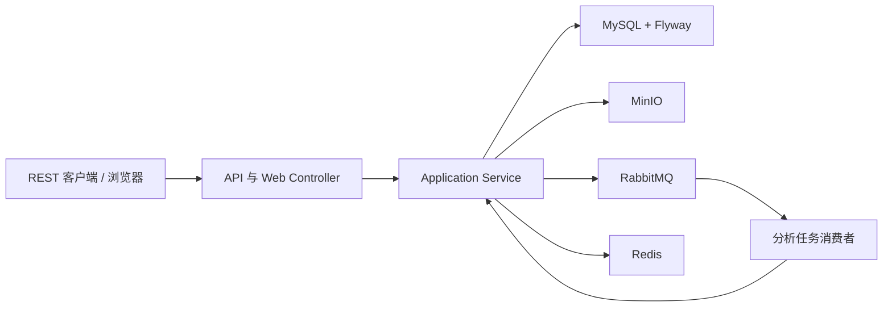

# Track Evaluation Platform

多源航迹分析与评测平台，面向轨迹数据上传、解析、质量评估、异步任务处理和结果报告场景。项目以 Java 17 和 Spring Boot 为基础，采用模块化单体架构，适合作为后端工程实践、系统设计和算法评测平台的公开示例。

> 公开仓库边界：仓库只包含人工构造的非敏感样例、通用代码和公开文档；不包含密码、Token、个人信息、单位代码、内部资料或真实科研项目数据。

## 项目背景

多源传感器会产生格式相近但质量和误差特征不同的航迹数据。平台提供统一的数据接入、持久化、分析、异步调度和报告查询能力，帮助验证算法质量并保留可复现的工程证据。

## 核心功能

- 用户注册、登录、JWT 鉴权、浏览器 Session 和数据所有权隔离。
- CSV 航迹文件流式校验、SHA-256 去重、MinIO 私有对象存储和批量入库。
- 三维位置误差、均值误差、RMSE、极值、标准差、异常点及连续异常区间分析。
- 同步分析与 RabbitMQ 异步任务，支持重试、死信、任务租约和基础幂等。
- Redis Cache-Aside 缓存最新结果和数据集比较结果，并在数据变化后失效。
- 分析结果历史、跨来源比较、自包含 HTML 报告、下载和管理审计页面。

## 技术栈

Java 17、Spring Boot 3.5、Spring MVC/Security、JWT、Thymeleaf、MyBatis-Plus、MyBatis XML、Flyway、MySQL 8.4、Redis 8、RabbitMQ 4、MinIO、springdoc OpenAPI、JUnit、Mockito、MockMvc 和 Testcontainers。

## 系统架构

项目按业务特性组织为模块化单体：Controller 负责 HTTP 转换，Application Service 负责用例编排和事务边界，Domain 保存业务规则，Infrastructure 负责数据库、对象存储和消息中间件适配。



## 关键工程设计

- 输入文件采用流式处理和分批写入，避免把完整上传文件加载进内存。
- 所有业务查询在应用层执行用户/数据集所有权约束，响应使用 DTO/VO，不直接暴露持久化对象。
- 数据库结构通过不可变的 Flyway 版本迁移初始化；表名和列名使用 `snake_case`。
- 异步任务使用手动 ACK、有限重试、死信队列、数据库状态幂等和租约恢复。
- 日志使用请求 ID 和 MDC；不输出密码、完整 JWT、基础设施凭据或完整 CSV 内容。
- REST API 和浏览器页面共用应用服务，但使用隔离的安全链，避免重复业务模型。

## 启动方式

环境要求：JDK 17、Maven Wrapper、Docker Desktop/Engine 和 Compose v2。

```powershell
Copy-Item .env.example .env
# 编辑 .env，替换所有 replace-with-* 和生成 JWT_SECRET；不要提交 .env
docker compose --env-file .env config --quiet
.\scripts\init-database.ps1
.\mvnw.cmd spring-boot:run
```

应用启动后访问：

- REST API：`http://127.0.0.1:8080`
- Swagger UI：`http://127.0.0.1:8080/swagger-ui.html`
- OpenAPI JSON：`http://127.0.0.1:8080/v3/api-docs`
- 健康检查：`http://127.0.0.1:8080/actuator/health`

容器化运行：

```powershell
docker compose --env-file .env -f docker-compose.yml -f compose.app.yaml up -d --build
docker compose --env-file .env -f docker-compose.yml -f compose.app.yaml ps
```

数据库由应用启动时的 Flyway 迁移初始化，迁移文件位于 `src/main/resources/db/migration`。脚本只校验占位配置、启动依赖并等待 MySQL 健康，不打印任何凭据。

## 接口文档与测试

- 接口说明：[`docs/api.md`](docs/api.md)
- 架构说明：[`docs/architecture.md`](docs/architecture.md)
- 数据库说明：[`docs/database.md`](docs/database.md)
- 测试策略：[`docs/testing.md`](docs/testing.md)
- 演示指南：[`docs/demo-guide.md`](docs/demo-guide.md)

```powershell
.\mvnw.cmd spotless:check
.\mvnw.cmd clean verify
# 需要 Docker 时再运行 Testcontainers 集成测试
.\mvnw.cmd clean verify -Pit
```

## 演示截图

截图应来自可复现的本地演示，并在提交前确认不包含用户名、密码、Token、内网地址、真实数据或个人信息。截图目录和命名规范见 [`docs/screenshots/README.md`](docs/screenshots/README.md)。当前仓库不伪造未实际采集的截图；补充截图后可在此处加入图片链接。

## 后续规划

当前公开基线以 `PLANS.md` 的真实验收记录为准。后续优先完善浏览器端业务流程的独立视觉验收、更多 Redis 集成覆盖、业务审计覆盖和并发恢复测试；不把 Transactional Outbox、微服务拆分、Kubernetes、Kafka 或 AI 报告列为当前完成条件。

## 公开仓库检查清单

- 使用仓库名 `track-evaluation-platform` 或同方向名称。
- 只提交 `.env.example` 等占位配置，不提交 `.env`、密码、Token、个人信息和真实项目数据。
- 不提交科研单位代码、内部文档、内网地址或未脱敏截图。
- 简历中使用“GitHub：项目链接”等带语义的链接文本，而不是裸 URL。

## License

如需公开发布，请在仓库正式创建前补充与项目使用范围一致的许可证文件。
