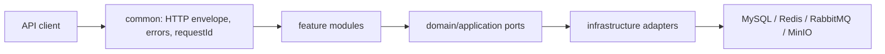

# 多源航迹数据分析与报告管理平台

`track-analysis-platform` 是一个面向 Java 后端工程实践的模块化单体项目。目标业务闭环是：安全地接收七列航迹 CSV，流式解析和批量入库，异步计算三维误差与连续异常区间，并管理分析结果和模板报告。

> 当前状态：里程碑 0（规划与可运行骨架）已完成真实环境验收。项目以 Java 17 为当前统一基线；19 个测试、应用烟测和四个 Compose 服务的健康及实际可用性检查均已通过。数据库业务表、认证、上传、分析、消息、缓存和报告业务仍未实现，必须等待明确指令后才能进入里程碑 1。

## 当前功能

- `GET /api/v1/ping`：统一 `Result<T>` 成功响应。
- `X-Request-Id`：接受安全的调用方 ID，缺失或不安全时生成 UUID，并写入响应头和 MDC。
- 全局异常映射：稳定业务错误码、合理 HTTP 状态、安全的未知错误响应。
- Actuator：health、info、metrics、Prometheus 端点基础配置。
- Compose 基础依赖定义：MySQL、Redis、RabbitMQ、MinIO（尚未接入应用代码）。

## 技术基线

- Java 17 bytecode/API target, Maven, Spring Boot 3.5.15
- Spring MVC, Validation, Actuator, Micrometer Prometheus registry
- JUnit 5, MockMvc, AssertJ, JaCoCo, Spotless
- MySQL 8.4, Redis 8.x, RabbitMQ 4.x, MinIO through Docker Compose

MyBatis/Flyway/Security/Redis/RabbitMQ/MinIO application dependencies are deliberately deferred to their milestones.

## Architecture



The current code only contains `common` and empty feature package boundaries. See [docs/architecture.md](docs/architecture.md) for current-versus-target detail.

## Core target flow

Register/login → create dataset → stream CSV to MinIO → create analysis task and Outbox event → publish to RabbitMQ → stream parse and batch insert → compute metrics/intervals → cache result → generate template report.

This flow is a roadmap, not a statement of currently completed functionality.

## Quick start

Prerequisites: JDK 17, Docker Desktop with Compose v2. Maven does not need a global installation when using the wrapper.

PowerShell:

```powershell
Copy-Item .env.example .env
# Replace every placeholder in .env before starting containers.
docker compose up -d
.\mvnw.cmd spring-boot:run
```

POSIX shell:

```bash
cp .env.example .env
# Replace every placeholder in .env before starting containers.
docker compose up -d
./mvnw spring-boot:run
```

Then call:

```powershell
Invoke-RestMethod http://localhost:8080/api/v1/ping
Invoke-RestMethod http://localhost:8080/actuator/health
```

Stop containers with `docker compose down`. `docker compose down -v` also deletes named volumes and permanently clears local data.

## Environment variables and ports

Copy `.env.example` to the ignored `.env`; never commit real credentials.

All middleware ports bind to `127.0.0.1` by default through `BIND_ADDRESS`. Override it in the ignored `.env` only when remote access is deliberately required and protected.

`REDIS_PASSWORD` must be 16-128 characters and use only ASCII letters, digits, dot, underscore, or hyphen. The Redis container rejects invalid values before startup without echoing the supplied value. This restricted alphabet keeps the generated Redis configuration unambiguous; use a password manager to generate a sufficiently long random value within it.

| Service | Default host port(s) | Required secret variables |
| --- | --- | --- |
| MySQL | 3306 | `MYSQL_PASSWORD`, `MYSQL_ROOT_PASSWORD` |
| Redis | 6379 | `REDIS_PASSWORD` |
| RabbitMQ | 5672, 15672 | `RABBITMQ_DEFAULT_PASS` |
| MinIO | 9000, 9001 | `MINIO_ROOT_PASSWORD` |
| Application | 8080 | none in milestone 0 |

## API documentation

The implemented endpoint contract is in [docs/api.md](docs/api.md). Interactive OpenAPI is planned for milestone 11 and is not currently available.

## Demo account initialization

No authentication or demo account exists in milestone 0. A repeatable, non-hardcoded initialization mechanism will be added with authentication and demo closeout milestones.

## Build and test

```powershell
.\mvnw.cmd spotless:apply
.\mvnw.cmd clean verify
```

JaCoCo HTML output is generated under `target/site/jacoco/`. Test and coverage results are only considered verified after these commands complete successfully on the current checkout; see [PLANS.md](PLANS.md) for the latest recorded status.

### Latest local verification

On 2026-07-16, `java` and Maven Wrapper both used JetBrains OpenJDK 17.0.14 from `D:\java\JDK17`. Maven 3.9.11 compiled with `--release 17` and produced Java 17 class-file version 61.

- `spotless:apply` and `spotless:check`: passed.
- `clean verify`: passed; 19 tests, 0 failures, 0 errors, 0 skipped.
- Dependency tree: completed with no Maven warnings and no conflict-omission entries.
- Packaged application smoke test on JDK 17: `/actuator/health` returned `UP`; `/api/v1/ping` returned `SUCCESS` and preserved the supplied request ID. The process stopped cleanly.
- Docker: Desktop 4.82.0, Engine 29.6.1 on Linux/amd64, and Compose v5.3.0. A forced recreation preserved all named volumes; MySQL, Redis, RabbitMQ, and MinIO all reached `healthy`, passed service-specific connection or endpoint checks, and published ports only on `127.0.0.1`. MySQL and Redis health checks authenticate through process environment variables rather than password arguments. Redis validates its password, creates a `600 redis:redis` temporary configuration on every start, and keeps the real value out of container command metadata, PID 1 arguments, health-check metadata, and logs.
- The first two Docker Hub pulls ended with transient `EOF`; the third finite retry succeeded without changing image tags.
- WSL 2.7.10.0 is installed and Ubuntu uses WSL 2.

Historical note: before Java 17 became the project baseline, a JDK 25.0.3 build targeting release 21 also passed seven tests. It is historical evidence only and is not the current acceptance result.

The environment checks have isolated regression harnesses that do not permanently alter user configuration:

```powershell
.\scripts\test-check-environment.ps1
bash ./scripts/test-redis-password-policy.sh
```

```bash
./scripts/test-check-environment.sh
./scripts/test-redis-password-policy.sh
```

## Performance summary

No performance measurements exist yet. Benchmarks and honest same-machine comparisons belong to milestone 10; [docs/performance.md](docs/performance.md) intentionally contains no invented numbers.

## Troubleshooting

- `java -version` and `.\mvnw.cmd -version` must both report Java 17 for the supported development baseline.
- If the wrapper download fails, verify access to Maven Central and proxy settings.
- If Compose rejects variables, ensure `.env` exists and no placeholder remains.
- If a port is occupied, change only the corresponding host-port variable in `.env`.
- Inspect container state with `docker compose ps` and logs with `docker compose logs <service>`.

## Known limitations

- Milestones 1-12 are pending; this is not yet the full business product.
- The Maven Wrapper works without global Maven. The supported and verified runtime is JDK 17; an installed JDK 25 is not used by the project acceptance workflow.
- Compose services are infrastructure-only in milestone 0. The Spring Boot application deliberately has no business integration with them yet.
- Docker Hub can occasionally return a transient `EOF`; use a finite retry and inspect Docker Desktop proxy/network settings if it persists.
- Prometheus and Grafana containers are intentionally deferred to observability milestone 9.

Inspect the already configured infrastructure with:

```powershell
docker compose --env-file .env config --quiet
docker compose --env-file .env up -d
docker compose ps
```

Do not use `docker compose down -v` unless deleting all local dependency data is intended.

## Roadmap

The ordered roadmap is maintained in [PLANS.md](PLANS.md): database → authentication → datasets/storage → CSV ingestion → synchronous analysis → RabbitMQ → Outbox → cache/rate limit → observability → performance → engineering closeout → resume/interview evidence.
