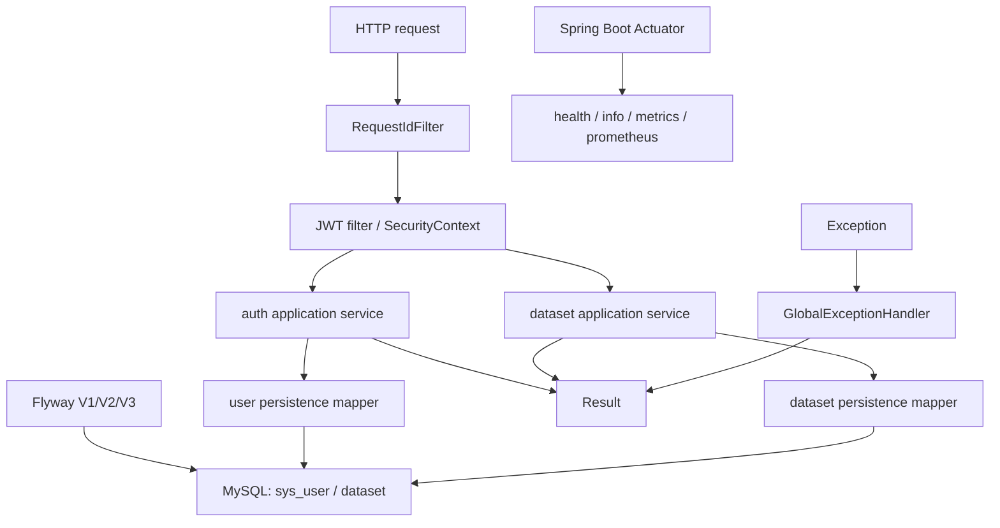
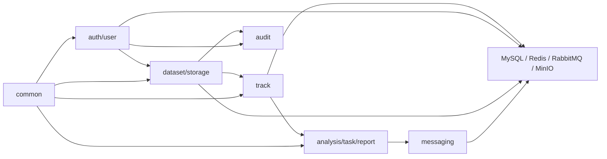
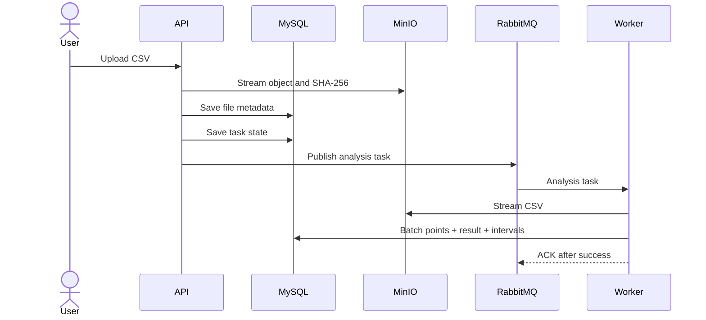

# Architecture

## Current milestone 2

The application remains one Spring Boot process. Spring Security authenticates one signed JWT Access Token, reloads the current user for every protected request, and rejects deleted, disabled, or invalidated accounts. Application services own transactions; feature-local MyBatis-Plus mappers include ownership in dataset SQL. No Refresh Token, Redis login state, RBAC, upload, analysis, messaging, cache, report, or production XML mapper exists.

## Target modular monolith

Feature modules own their HTTP, application, domain, and infrastructure code. Cross-feature interaction should enter through application/domain contracts rather than reaching into another feature's mapper or SDK.

The diagram expresses intended dependency flow, not completed code.

## Target upload and analysis sequence

This sequence will be introduced incrementally: database persistence in milestone 1, authentication/datasets in milestone 2, storage and streaming ingestion in milestone 3, synchronous analysis closure in milestone 4, and messaging/cache in milestone 5. Transactional Outbox is outside the first release and requires separate approval.

## Target cache flow

Result queries use cache-aside: Redis hit returns a JSON value; a miss reads MySQL and fills a bounded-TTL entry. Task completion commits MySQL first and invalidates the old key. Redis outage should degrade result queries to MySQL. This is planned for milestone 5; complex rate limiting is outside the first release.

## Implemented authorization flow

Spring Security runs statelessly with CSRF, form login and HTTP Basic disabled. The JWT filter verifies signature, issuer and expiry, then loads `sys_user` and compares `authVersion` before building an immutable principal. Logout atomically increments `auth_version`, invalidating every previously issued token for that user. Dataset reads, writes and deletes require `(dataset.id, current user_id, deleted = 0)` in Mapper SQL; inaccessible resources return 404. There is one ordinary-user role only and no RBAC table.

## Delivery boundary

The active route contains seven milestones numbered 0-6. Milestones 0, 1 and 2 are complete; milestone 3 has not started. The first release remains a modular monolith and prioritizes a demonstrable upload-analysis-report business closure over infrastructure breadth. The former 0-12 route is historical. Transactional Outbox, microservice decomposition, and a Prometheus/Grafana platform are future extensions only.

## Dependency rules

1. Controllers depend on application use cases and boundary DTO/VO types.
2. Application code owns orchestration and transactions; it does not concatenate SQL.
3. Domain rules do not import MinIO, Redis, RabbitMQ, servlet, or mapper SDKs.
4. Infrastructure adapters implement explicit ports only when isolation has value.
5. No external network call is held inside a long database transaction.
