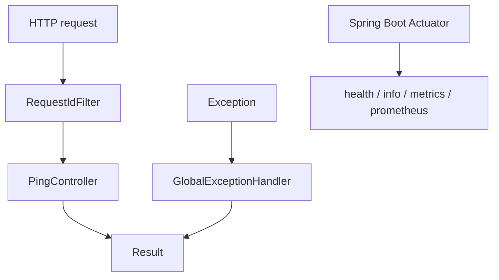
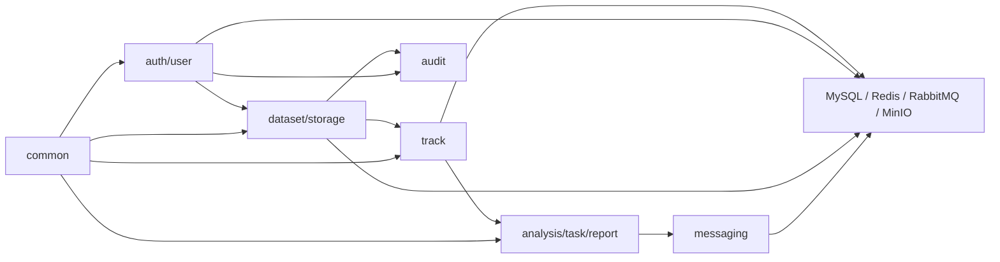
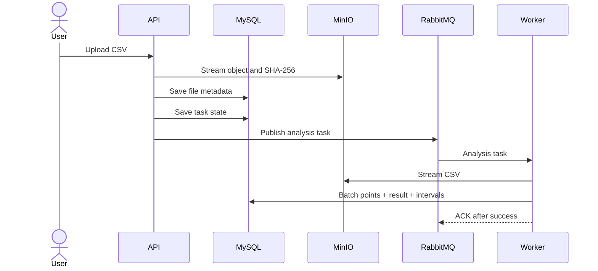

# Architecture

## Current milestone 0

The application is a single Spring Boot process. Only cross-cutting HTTP behavior and feature package boundaries exist. Compose defines external services but the application has no SDK, connection, or persistence code for them yet.

## Target modular monolith

Feature modules own their HTTP, application, domain, and infrastructure code. Cross-feature interaction should enter through application/domain contracts rather than reaching into another feature's mapper or SDK.

The diagram expresses intended dependency flow, not completed code.

## Target upload and analysis sequence

This sequence will be introduced incrementally: database persistence in milestone 1, authentication/datasets in milestone 2, storage and streaming ingestion in milestone 3, synchronous analysis closure in milestone 4, and messaging/cache in milestone 5. Transactional Outbox is outside the first release and requires separate approval.

## Target cache flow

Result queries use cache-aside: Redis hit returns a JSON value; a miss reads MySQL and fills a bounded-TTL entry. Task completion commits MySQL first and invalidates the old key. Redis outage should degrade result queries to MySQL. This is planned for milestone 5; complex rate limiting is outside the first release.

## Target authorization flow

Spring Security authenticates an access token, builds the security context, and application queries include the current user ID when loading owned resources. Administrators use explicit roles. Returning 404 for inaccessible owned resources may reduce enumeration while 401 and 403 remain semantically distinct. This is planned for milestone 2.

## Delivery boundary

The active route contains seven milestones numbered 0-6. Milestone 0 is complete and milestone 1 is next but has not started. The first release remains a modular monolith and prioritizes a demonstrable upload-analysis-report business closure over infrastructure breadth. The former 0-12 route is a historical plan, has been retired, and is not the current execution route. Transactional Outbox, microservice decomposition, and a Prometheus/Grafana platform are future extensions only.

## Dependency rules

1. Controllers depend on application use cases and boundary DTO/VO types.
2. Application code owns orchestration and transactions; it does not concatenate SQL.
3. Domain rules do not import MinIO, Redis, RabbitMQ, servlet, or mapper SDKs.
4. Infrastructure adapters implement explicit ports only when isolation has value.
5. No external network call is held inside a long database transaction.
