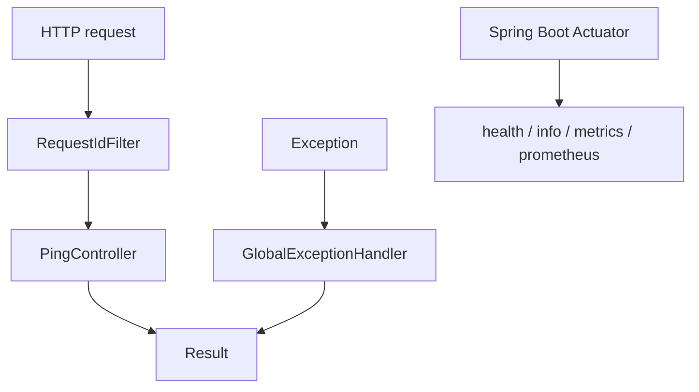
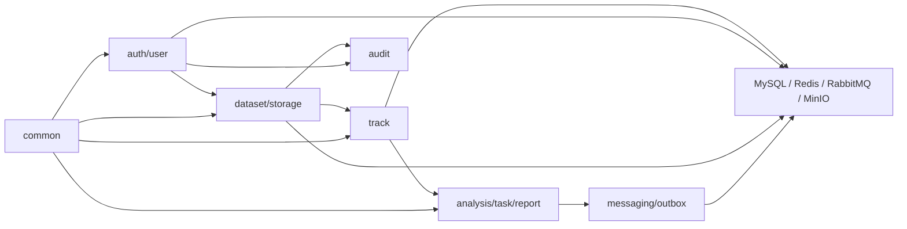
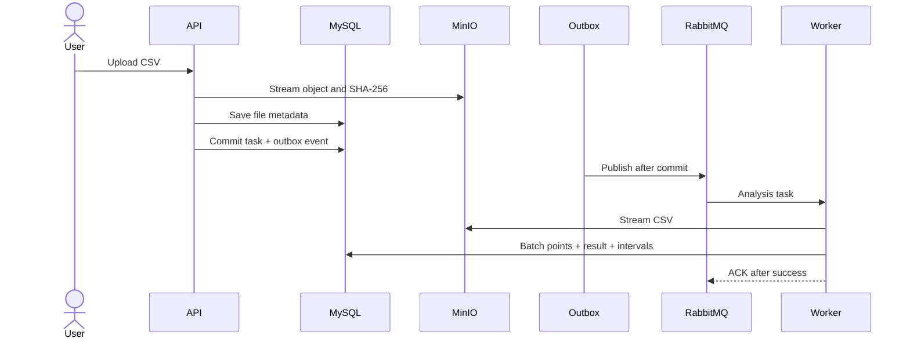

# Architecture

## Current milestone 0

The application is a single Spring Boot process. Only cross-cutting HTTP behavior and feature package boundaries exist. Compose defines external services but the application has no SDK, connection, or persistence code for them yet.

## Target modular monolith

Feature modules own their HTTP, application, domain, and infrastructure code. Cross-feature interaction should enter through application/domain contracts rather than reaching into another feature's mapper or SDK.

The diagram expresses intended dependency flow, not completed code.

## Target upload and analysis sequence

This sequence will be introduced incrementally: storage in milestone 3, synchronous parsing/analysis in milestones 4-5, messaging in milestone 6, and Outbox in milestone 7.

## Target cache flow

Result queries use cache-aside: Redis hit returns a JSON value; a miss reads MySQL and fills a bounded-TTL entry. Task completion commits MySQL first and invalidates the old key. Redis outage degrades database result queries but not token refresh or rate limits silently. This is planned for milestone 8.

## Target authorization flow

Spring Security authenticates an access token, builds the security context, and application queries include the current user ID when loading owned resources. Administrators use explicit roles. Returning 404 for inaccessible owned resources may reduce enumeration while 401 and 403 remain semantically distinct. This is planned for milestone 2.

## Dependency rules

1. Controllers depend on application use cases and boundary DTO/VO types.
2. Application code owns orchestration and transactions; it does not concatenate SQL.
3. Domain rules do not import MinIO, Redis, RabbitMQ, servlet, or mapper SDKs.
4. Infrastructure adapters implement explicit ports only when isolation has value.
5. No external network call is held inside a long database transaction.
