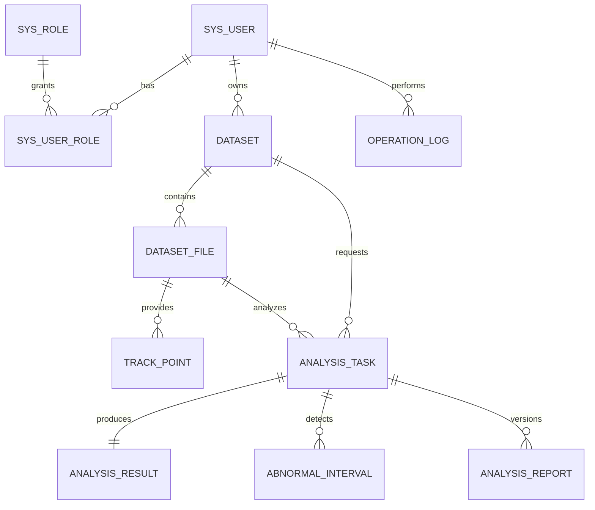

# Database Design

## Status

Milestone 1 has not started. There are no Flyway migrations, entities, mappers, executed SQL statements, or `EXPLAIN` results yet. This document records the proposed model only; it will be replaced with migration-backed evidence.

## Proposed logical ER model

Planned first-release tables are `sys_user`, `sys_role`, `sys_user_role`, `dataset`, `dataset_file`, `track_point`, `analysis_task`, `analysis_result`, `abnormal_interval`, `analysis_report`, and `operation_log`. Exact milestone 1 scope remains subject to its stage plan and user confirmation.

## Planned constraints and indexes

- Unique usernames and role codes; unique `(user_id, role_id)` assignments.
- Ownership query index on `dataset.user_id` and logical deletion status.
- File metadata index on `dataset_file.dataset_id`; duplicate upload defense will use an ownership-aware business key after query design.
- Track lookup indexes `(dataset_id, time_value)` and `(dataset_id, error_value)`; initial uniqueness candidate is `(file_id, time_value)` for the single-source/single-target format.
- Unique task request ID and unique result task ID for idempotency defenses.

## Planned transaction boundaries

- Schema changes only through new immutable Flyway versions.
- Batch track-point writes use explicit chunk/rollback semantics; no per-row transaction.
- RabbitMQ publication and database state cannot be falsely described as one local transaction; milestone 5 will use bounded retry and basic idempotency within its approved first-release scope.
- MinIO and MySQL cannot share a local transaction, so upload requires compensation and reconciliation rather than a false atomic claim.

## Core SQL and EXPLAIN

No core SQL exists yet, so no `EXPLAIN` result is claimed. Milestone 1 will document the exact select columns, predicates, fixtures, MySQL version, plan output, and why each index supports an observed access path.

Transactional Outbox is not part of the first-release schema or Definition of Done. It may be reconsidered only as a separately approved future extension. The former 0-12 roadmap that included an Outbox milestone is a historical plan, has been retired, and is not the current execution route.
