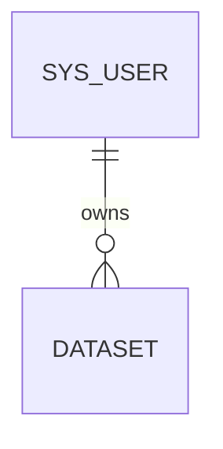

# Database Design

## Implemented scope

Milestone 1 creates exactly two business tables through immutable Flyway migrations:

- `V1__create_sys_user.sql`
- `V2__create_dataset.sql`

Flyway also owns `flyway_schema_history`. No role, file, track-point, analysis, task, interval, report, audit, or outbox table exists yet.

## Common rules

- MySQL 8.4, InnoDB, `utf8mb4`, and `utf8mb4_0900_ai_ci`.
- Signed `BIGINT AUTO_INCREMENT` identifiers mapped to Java `Long`.
- `DATETIME(6)` stores UTC local date-time values; JDBC forces the session to `+00:00` and Java uses a UTC `Clock`.
- Java `MetaObjectHandler` is the primary writer for `created_at` and `updated_at`. Database `CURRENT_TIMESTAMP(6)` defaults are insert fallbacks; `updated_at` has no database `ON UPDATE` clause.
- `version` is the optimistic-lock counter and `deleted` is the `0/1` logical-delete flag.
- No common BaseDO, `created_by`, or `updated_by` abstraction exists.

## `sys_user`

| Column | Type | Null | Default | Purpose |
| --- | --- | --- | --- | --- |
| `id` | `BIGINT` | no | auto increment | primary key |
| `username` | `VARCHAR(64)` | no | none | case-insensitive login name |
| `password_hash` | `VARCHAR(255)` | no | none | encoded password only; authentication is not implemented |
| `status` | `VARCHAR(16)` | no | `ACTIVE` | `ACTIVE` or `DISABLED` |
| `version` | `INT UNSIGNED` | no | `0` | optimistic lock |
| `deleted` | `TINYINT UNSIGNED` | no | `0` | logical deletion |
| `created_at` | `DATETIME(6)` | no | current timestamp | UTC creation time |
| `updated_at` | `DATETIME(6)` | no | current timestamp | UTC Java-managed update time |

`uk_sys_user_username` permanently reserves a username even after logical deletion. CHECK constraints restrict `status` and `deleted`. There are no role tables.

## `dataset`

| Column | Type | Null | Default | Purpose |
| --- | --- | --- | --- | --- |
| `id` | `BIGINT` | no | auto increment | primary key |
| `user_id` | `BIGINT` | no | none | owning `sys_user` |
| `name` | `VARCHAR(128)` | no | none | display name; not unique |
| `description` | `VARCHAR(500)` | yes | `NULL` | optional description |
| `version` | `INT UNSIGNED` | no | `0` | optimistic lock |
| `deleted` | `TINYINT UNSIGNED` | no | `0` | logical deletion |
| `created_at` | `DATETIME(6)` | no | current timestamp | UTC creation time |
| `updated_at` | `DATETIME(6)` | no | current timestamp | UTC Java-managed update time |

`fk_dataset_user` uses `ON UPDATE RESTRICT` and `ON DELETE RESTRICT`. `idx_dataset_owner_page (user_id, deleted, created_at DESC, id DESC)` supports owner-scoped active-dataset pagination ordered by newest creation time and ID. No redundant name or standalone owner index was added.

## Verified behavior

MySQL 8.4 Testcontainers verifies empty-schema migration, repeat migration, checksums, metadata, primary/unique/foreign/check constraints, NOT NULL behavior, index order, mapper insert/query/pagination, logical deletion, optimistic locking, UTC filling, test transaction rollback, and BlockAttack behavior.

The integration suite executes the owner pagination SQL with `EXPLAIN` and asserts that a plan is returned. It deliberately does not assert the optimizer's selected access path on the tiny fixture and makes no performance claim.

## Transactions and deferred schema

Application-service public use cases will own `@Transactional`; controllers and mappers do not. Runtime exceptions roll back by default, checked exceptions require deliberate conversion or `rollbackFor`, and external MinIO/RabbitMQ calls must not be held inside long database transactions.

`dataset_file`, `track_point`, analysis/task/result/interval tables, reports, roles, audit logs, and Outbox are deferred until their business milestones define real fields and query paths. Transactional Outbox remains outside the first release.
