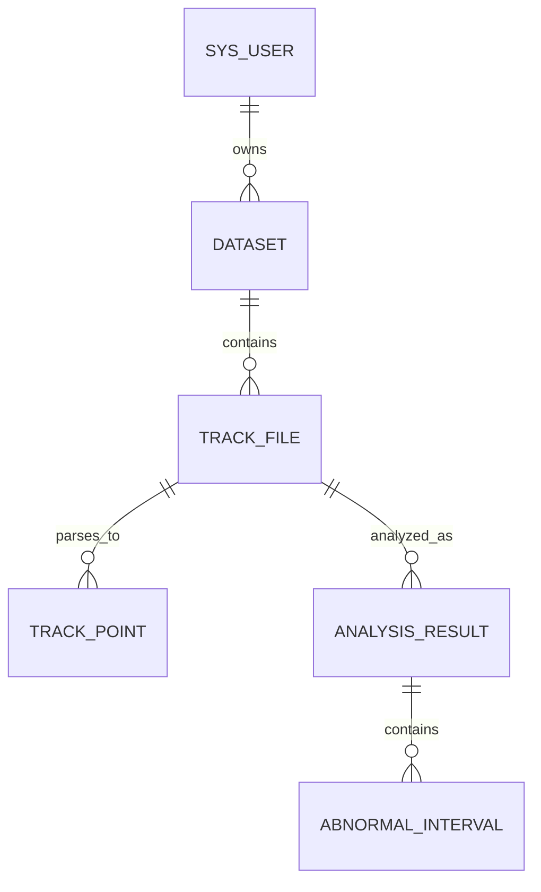

# Database Design

## Implemented scope

Milestones 1-4 contain six business tables through immutable Flyway migrations:

- `V1__create_sys_user.sql`
- `V2__create_dataset.sql`
- `V3__add_user_auth_version.sql`
- `V4__create_track_file.sql`
- `V5__create_track_point.sql`
- `V6__create_analysis_result.sql`
- `V7__create_abnormal_interval.sql`

Flyway also owns `flyway_schema_history`. No role, task, report, audit, or outbox table exists.

## `track_file` and `track_point`

`track_file` stores immutable upload identity (`dataset_id`, sanitized `original_name`, private `object_name`, SHA-256, size and source) plus the guarded `UPLOADED`/`PARSING`/`PARSED`/`FAILED` parse state, point count, safe error, version and UTC timestamps. Object names are unique and `(dataset_id, sha256)` is the final deduplication defense. The owner page index is `(dataset_id, created_at DESC, id DESC)`.

`track_point` stores `track_file_id`, one-based `sequence_no`, `time_value` and the six true/track coordinates plus creation time. `(track_file_id, sequence_no)` is unique and `(track_file_id, time_value)` supports ordered access. It intentionally has no position-error or analysis-result column; all seven doubles are checked for finiteness before insertion.

## Common rules

- MySQL 8.4, InnoDB, `utf8mb4`, and `utf8mb4_0900_ai_ci`.
- Signed `BIGINT AUTO_INCREMENT` identifiers mapped to Java `Long`.
- `DATETIME(6)` stores UTC local date-time values; JDBC forces the session to `+00:00` and Java uses a UTC `Clock`.
- Java `MetaObjectHandler` is the primary writer for `created_at` and `updated_at`. Database `CURRENT_TIMESTAMP(6)` defaults are insert fallbacks; `updated_at` has no database `ON UPDATE` clause.
- `version` is the optimistic-lock counter and `deleted` is the `0/1` logical-delete flag.
- No common BaseDO, `created_by`, or `updated_by` abstraction exists.

## `sys_user`

| Column | Type | Null | Default | Purpose |
| --- | --- | --- | --- | --- |
| `id` | `BIGINT` | no | auto increment | primary key |
| `username` | `VARCHAR(64)` | no | none | case-insensitive login name |
| `password_hash` | `VARCHAR(255)` | no | none | BCrypt hash only |
| `status` | `VARCHAR(16)` | no | `ACTIVE` | `ACTIVE` or `DISABLED` |
| `auth_version` | `INT UNSIGNED` | no | `0` | invalidates all older JWTs when incremented |
| `version` | `INT UNSIGNED` | no | `0` | optimistic lock |
| `deleted` | `TINYINT UNSIGNED` | no | `0` | logical deletion |
| `created_at` | `DATETIME(6)` | no | current timestamp | UTC creation time |
| `updated_at` | `DATETIME(6)` | no | current timestamp | UTC Java-managed update time |

`uk_sys_user_username` permanently reserves a username even after logical deletion. CHECK constraints restrict `status` and `deleted`. There are no role tables.

## `dataset`

| Column | Type | Null | Default | Purpose |
| --- | --- | --- | --- | --- |
| `id` | `BIGINT` | no | auto increment | primary key |
| `user_id` | `BIGINT` | no | none | owning `sys_user` |
| `name` | `VARCHAR(128)` | no | none | display name; not unique |
| `description` | `VARCHAR(500)` | yes | `NULL` | optional description |
| `version` | `INT UNSIGNED` | no | `0` | optimistic lock |
| `deleted` | `TINYINT UNSIGNED` | no | `0` | logical deletion |
| `created_at` | `DATETIME(6)` | no | current timestamp | UTC creation time |
| `updated_at` | `DATETIME(6)` | no | current timestamp | UTC Java-managed update time |

`fk_dataset_user` uses `ON UPDATE RESTRICT` and `ON DELETE RESTRICT`. `idx_dataset_owner_page (user_id, deleted, created_at DESC, id DESC)` supports owner-scoped active-dataset pagination ordered by newest creation time and ID. No redundant name or standalone owner index was added.

## Verified behavior

MySQL 8.4 Testcontainers verifies empty-schema V1-V5 migration, V2-to-V3 and V3-to-V5 forward upgrades, repeat migration, checksums, `auth_version` default/NOT NULL behavior, track-file/point metadata and constraints, index order, authentication/logout behavior, owner-scoped dataset and track-file CRUD/pagination/search, logical deletion, optimistic locking, UTC filling, test transaction rollback, and BlockAttack behavior.

The integration suite executes the owner pagination SQL with `EXPLAIN` and asserts that a plan is returned. It deliberately does not assert the optimizer's selected access path on the tiny fixture and makes no performance claim.

## Transactions and deferred schema

Application-service public use cases own `@Transactional`; controllers and mappers do not. Runtime exceptions roll back by default, checked exceptions require deliberate conversion or `rollbackFor`, and external MinIO/RabbitMQ calls must not be held inside long database transactions.

Task, report, role, audit-log and Outbox tables remain deferred. Transactional Outbox remains outside the first release.

## Milestone 4 analysis schema

V6 creates immutable `analysis_result` rows with threshold, point count, mean, RMSE, extrema, Welford population standard deviation, abnormal count/ratio and earliest maximum-error time. Its `(track_file_id, created_at DESC, id DESC)` index supports latest and history queries.

V7 creates `abnormal_interval` with ordered sequence/time bounds, point count, peak error/time and unique `(analysis_result_id, interval_no)`. Both foreign keys use `RESTRICT`. `track_point` deliberately does not persist `position_error`; error series are calculated dynamically. MySQL 8.4 tests cover empty V1-V7 migration and V5-to-V7 upgrade with existing user, dataset, file and point data preserved.

## Milestone 5 task schema

V8 creates `analysis_task`. It references one `track_file` and, only after success, one immutable `analysis_result`. Checks constrain threshold, attempts, status and the invariant that only `SUCCESS` may carry a result ID. `(track_file_id, created_at DESC, id DESC)` supports owner-scoped history; `(status, updated_at, id)` supports operational state access. State transitions use conditional updates so duplicate deliveries cannot claim a completed or already-running task. Both foreign keys use `RESTRICT`; task error text is capped at 500 characters and contains safe summaries only.

Migration acceptance covers empty V1—V8 and V5→V8 forward upgrade while preserving existing user, dataset, file and point rows.
# Milestone 6 database addition

Flyway V9 adds immutable `analysis_report(id,dataset_id,title,report_type,source_file_count,content_html,created_at)`. Its dataset foreign key is `RESTRICT`; checks enforce nonblank title/content, positive source count, and the first-release `DATASET_COMPARISON` type. History uses `(dataset_id,created_at DESC,id DESC)`. Reports have neither logical deletion nor version/update fields. V1–V9 are append-only migrations; analysis results and reports are immutable records.
